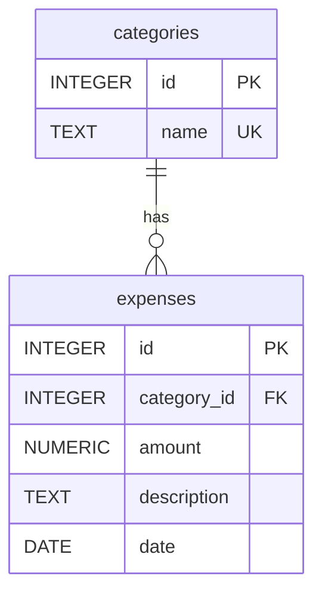

# Personal Expense Tracker

A PostgreSQL-backed expense tracker that lets you log spending by category and analyze where your money goes. The database stores expenses and the categories they belong to, and is designed to back a simple web dashboard.

---

## Use Cases

| # | Use Case |
|---|----------|
| 1 | As a user, I need to add a new expense category so I can organize my spending. |
| 2 | As a user, I need to view all categories so I can choose one when logging an expense. |
| 3 | As a user, I need to add a new expense with an amount, description, category, and date. |
| 4 | As a user, I need to view all my expenses (most recent first) so I can see my full spending history. |
| 5 | As a user, I need to filter expenses by category so I can see how much I spend in a specific area. |
| 6 | As a user, I need to view total spending per category so I can identify where most of my money goes. |
| 7 | As a user, I need to view expenses within a date range so I can review spending for a trip or billing period. |
| 8 | As a user, I need to view my total spending for a given month so I can check whether I'm on budget. |
| 9 | As a user, I need to delete an expense so I can correct data-entry mistakes. |

---

## Business Rules

### Structural Rules
- One category may have many expenses.
- Each expense must belong to exactly one category.

### Integrity Constraints

**Field Constraints**
- `categories.name` must not be null or empty, and must be unique — no duplicate category names are allowed.
- `expenses.amount` must be a positive number greater than zero.
- `expenses.description` must not be null or empty.
- `expenses.date` must be a valid calendar date (stored as `DATE`, entered as `YYYY-MM-DD`) so date comparisons and range queries work correctly.

**Relationship Constraints**
- An expense cannot exist without a valid, existing category (`category_id` is a non-nullable foreign key referencing `categories.id`).

### Derivation Rules
- Total spending for a category = `SUM(amount)` of all expenses where `category_id` matches.
- Total spending for a month = `SUM(amount)` of all expenses where `to_char(date, 'YYYY-MM')` matches the target month.
- Number of expenses per category = `COUNT(id)` grouped by `category_id`.

---

## Data Dictionary & Entity Relationship Diagram

### Entity Relationship Diagram

---

### Data Dictionary

#### Table: `categories`

| Column | Data Type | Constraints | Description |
|--------|-----------|-------------|-------------|
| `id` | INTEGER | PRIMARY KEY, GENERATED ALWAYS AS IDENTITY | Unique identifier for each category |
| `name` | TEXT | NOT NULL, UNIQUE | Human-readable category label (e.g., "Food & Dining") |

#### Table: `expenses`

| Column | Data Type | Constraints | Description |
|--------|-----------|-------------|-------------|
| `id` | INTEGER | PRIMARY KEY, GENERATED ALWAYS AS IDENTITY | Unique identifier for each expense |
| `category_id` | INTEGER | NOT NULL, FOREIGN KEY → `categories.id` | The category this expense belongs to |
| `amount` | NUMERIC(10, 2) | NOT NULL, CHECK (amount > 0) | Dollar amount of the expense |
| `description` | TEXT | NOT NULL | Short note describing what the expense was for |
| `date` | DATE | NOT NULL | Date of the expense |

---

## SQL Scripts

| File | Description |
|------|-------------|
| `sql/setup.sql` | Creates the `categories` and `expenses` tables and seeds default categories |
| `sql/queries.sql` | One SQL query per use case, with inline comments |
